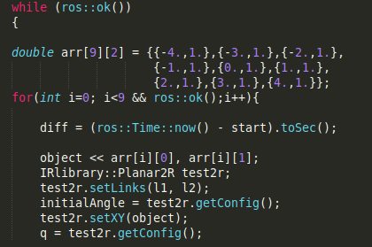
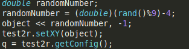
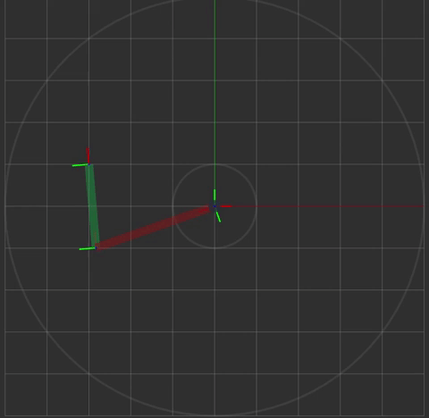
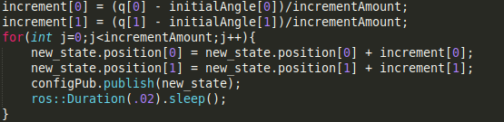
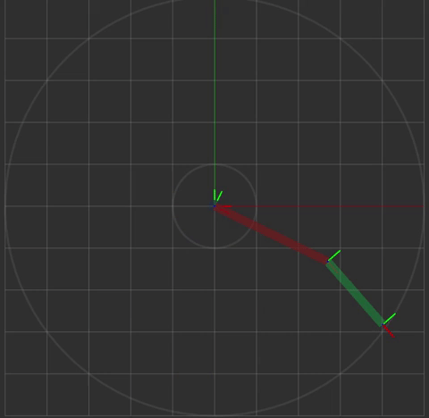
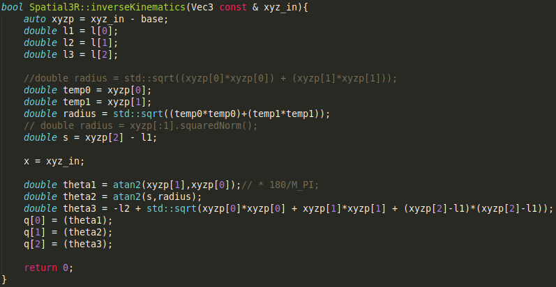
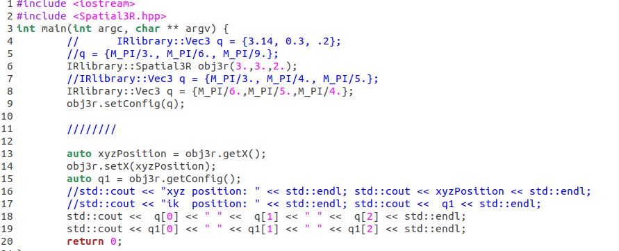
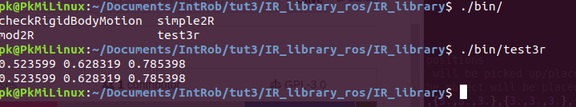
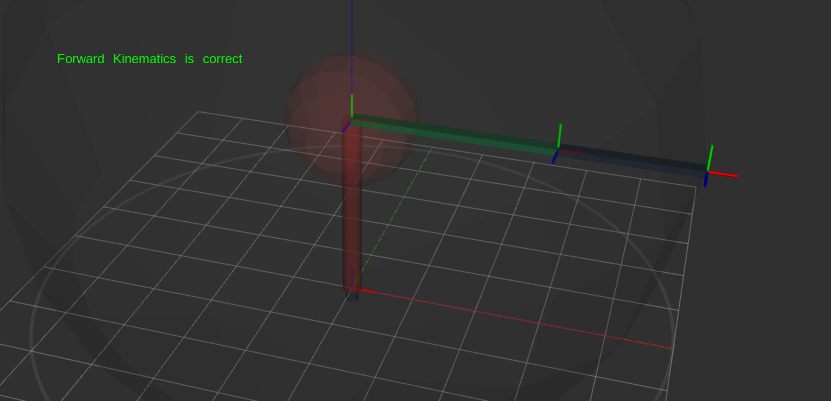

# IR_library_ros

## About 
This is a repository for Intelligent Robotics project.

## Concise:
More details with animations and pictures is below.

### Goal 

We wanted to create a robot that can pick up objects and place them in a line.

### Process

In order for a robot to do this, we must consider orientation, inverse kinematics, and task space.

~~~
Orientation
When the robot moves to pick up an object, we must consider the current
state of the robot in relation to where we want the robot to go. This goes hand in hand
with inverse kinematics.
~~~
~~~
Inverse Kinematics
Our goal is to pick up and place objects. To do this, we must
implement inverse kinematics twice for each object. When we calculate where the robot
must be, we need to have some frame of reference.
~~~
~~~
Task Space
For any robot, the workspace consists of the space that is within the robot’s
grasp. For this, we must think about the link lengths and feasible joint values. Since we
are dealing with simulations and not physical robots, the joint values can be a full 360
degrees around each joint.
~~~

### Results
There were some successes and some failures.

~~~
Success
There are 3 main things that I wanted to implement. Namely, picking up an
object, placing an object, and ensuring that everything is within the task space. In each
of these categories I was successful.
~~~
~~~
Failure
I wanted to have a working system using the spatial3r robot privided but was not
able to fulfill this goal. However, I did manage to have everything working well for the
planar2r robot. I believe this is due to a lack of experience with the ROS software as I
spoke with another classmate who came across the same issues. I also tried to
implement trajectory generation in order to have a smooth robot moving arm but was
unsuccessful.
~~~

### Sources
The main sources used were from the book, notes, lectures, and video. Essentially, everything
utilized was provided by the professor, except for the Eigen and ROS documentation. Below are
specific sources used:
~~~
Forward kinematics notes: used to test whether my inverse kinematics functions were
working properly.

Inverse kinematics notes: used to help create inverse kinematics functions

Tutorial 2, 3, 4 videos: these videos were paramount in helping me understand the ROS
system. I used the planar2r material given and experimented in depth to have a better
understanding of how ROS works.
~~~

# Details

We will start off by talking about what we did in Planar2r and move to how it relates to the Spatial3r.

I followed along the tutorial videos that Saurav released so I had some framework to work with. The goal was to pick up an object and place it on some line, then move onto the next object and place it somewhere along the same line. 

To simulate the objects, I created an array of arrays, where each element acted as the (x, y) coordinates around the 2r arm.

I then had to find a way to place them along some line. I thought about what we did in class, where we map out the possible positions and saw how a straight line in task space usually did not correlate to a straight line in the configuration space. This is a valid way of doing things, but I time is precious and the project was due in a short amount of time (probably around a week ago).

I decided to pull out my notebook and try a few things out. 
After a few trial and errors, I found a relationship!

~~~
Given some dimensional space, if we confine the possible 
values to one dimension then it will look like a straight line.

Specifically, if we were in a 2 dimensional space and keep 
one of the coordinates static, then the result would be a straight line.

We can scale this up to 3 coordinates, and I presume multiple coordinates.
~~~

This might seem elementary for other people, but for me it was a gift from God as it saved me lots of time.

I was able to code this idea in a few short lines:

Now what we have is a 2r planar robot who can move to objects, and then move to some point on a line. This is not necessarily "picking up" the object, but we can imagine that the objects are point objects and the end-effector is a magnet type of thing.

The objects to pick up were in a straight line, from left to right above the origin.
The line to place objects on is a straight line below the origin.
The location on the line where the objects were to be placed is random.

Here is our result:

From the animation we can see that the motions are instant. This is not good, so I tried to make trajectories. I thought of a solution which I thought would work - but it did not.

I thought that if we knew what the angles needed to be, then we can divide that angle by some incremental value, change the angle by that incremental value, and iterate the same number of increments. I thought this would result in smooth motion - which it did - however, it was not the motion I was looking for. After hours of trial and error and experimentation, here is my code and the result:

It should look like the first animation, except smooth. Despite my frustration, I had to move on as time was running short.

My next step was to translate what I understood about the 2r robot to the 3r spatial robot.

I was somewhat successful in this. The spatial 3r robot was moving - but not in a way that I expected it to move. Here is the code I wrote for the inverse kinematics function and the result.

I could not find a relationship between the input XYZ coordinates and the resulting motions.

I took a step back and thought there were something wrong with my inverse kinematics function so I decided to test it. 

To test it, I would do the following
- input some angle values for forward kinematics
- I would grab the coordinates of the end-effector 
- input the resulting coordinates into my inverse kinematics function
- see if the resulting angles were the same
- If the functions were working, then the angles should be the same

Here is the code I used to test it with:

I recieved the correct output, but still had problems. I thought perhaps the forward kinematics function somehow was wrong as well but giving the same output.

I remembered that the tutorials had us test the forward kinematics functions using RVIZ and it would tell us whether the forward kinematics was working or not. Naturally I tried it out and got this result:

Now I had solid evidence that my inverse kinematics function was working as intended but RVIZ was not doing what I expected.

I spoke with a number of other students and we all found the same problem. While I could spend more time with ROS and trying out other implementations and playing around with the software, project is due so I had to turn it in.
